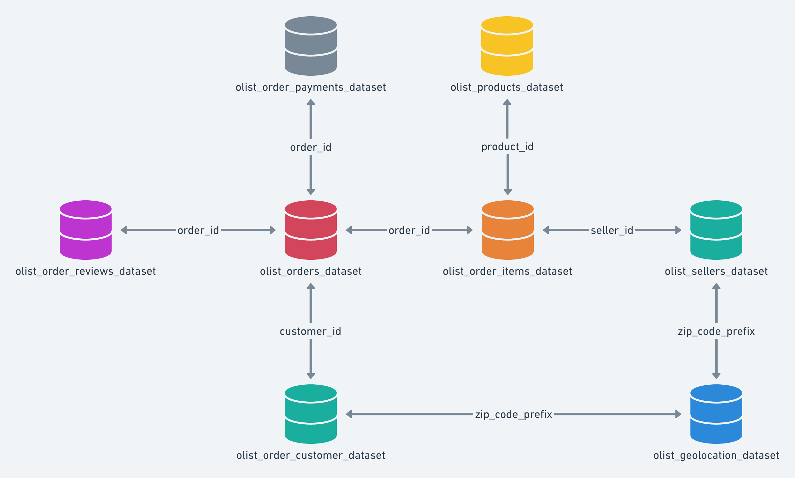

# Brazilian E-Commerce Customer Satisfaction Analysis

This project focuses on analyzing the Brazilian E-Commerce Public Dataset by Olist to enhance understanding and operational strategies within the Brazilian e-commerce sector, emphasizing customer satisfaction and logistic efficiency.

## Dataset Overview

### Data Source
- **Name**: Brazilian E-Commerce Public Dataset by Olist
- **Provider**: Olist Store, Andre Sionek, Dabague Francisco, Magioli
- **Source Link**: [Olist Dataset on Kaggle](https://www.kaggle.com/datasets/olistbr/brazilian-ecommerce/data)

### Data Description
This dataset offers a detailed account of 100,000 orders from the Olist Store, recorded between 2016 and 2018 across multiple Brazilian marketplaces. It includes comprehensive data related to order status, pricing, payment, and delivery performance, along with customer location, product attributes, and customer reviews. Notably, the dataset is anonymized to protect commercial confidentiality, with company and partner names in review texts replaced with names from the "Game of Thrones" series.

### Attributes
- **customer_id**: Key to orders dataset, unique per order.
- **customer_unique_id**: Unique identifier for a customer.
- **customer_zip_code_prefix**: First five digits of customer's zip code.
- **customer_city**: Name of the city the customer resides in.
- **customer_state**: State where the customer resides.
- **order_status**: Status of the order (e.g., delivered, shipped).
- **order_purchase_timestamp**: Timestamp when the purchase was made.
- **order_approved_at**: Timestamp when payment was approved.
- **order_delivered_carrier_date**: When the order was handed to the logistic partner.
- **order_delivered_customer_date**: Actual delivery date to the customer.
- **order_estimated_delivery_date**: Estimated delivery date informed at purchase.
- **review_id**: Unique identifier for the review.
- **order_id**: Unique identifier for the order.
- **review_score**: Customer satisfaction score, from 1 to 5.
- **review_comment_title**: Title of customer's review, in Portuguese.
- **review_comment_message**: Message of customer's review, in Portuguese.
- **review_creation_date**: Date the satisfaction survey was sent.
- **review_answer_timestamp**: Timestamp of survey answer.
- **seller_id**: Seller's unique identifier.
- **seller_zip_code_prefix**: First 5 digits of seller's zip code.
- **seller_city**: Name of the city the seller is located in.
- **seller_state**: State where the seller is located.
- **geolocation_zip_code_prefix**: First 5 digits of zip code for geolocation data.
- **geolocation_lat**: Geographic latitude.
- **geolocation_lng**: Geographic longitude.
- **geolocation_city**: Name of the city according to geolocation.
- **geolocation_state**: State abbreviation according to geolocation.

## Instructions

1. **Clone this repository to your local machine.**
2. **Navigate to the repository directory.**
3. **Ensure `import_data_final.py` is in the same directory as the Jupyter notebooks.**
4. **The import_data_final file has the code to unzip the files in the data directory and put them in an exclusive unzipped folder.**
5. **Run IS597MLC_Exploratory_Data_Analysis_Final_Project_Das_Akash.ipynb first to perform the exploratory data analysis.**
6. **After completing the EDA, proceed with IS597-MLC-Machine_Learning_Pipeline_Final_Project_Das_Akash.ipynb to apply machine learning models.**

## Conclusion
This project aims to enhance understanding and operational strategies within the Brazilian e-commerce sector by analyzing customer satisfaction and logistic efficiency using advanced data analytics and machine learning techniques.

